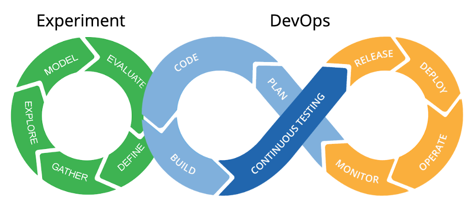
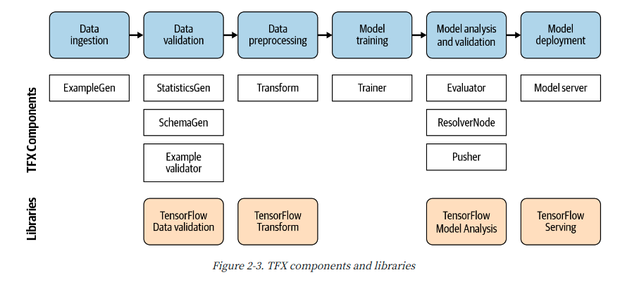
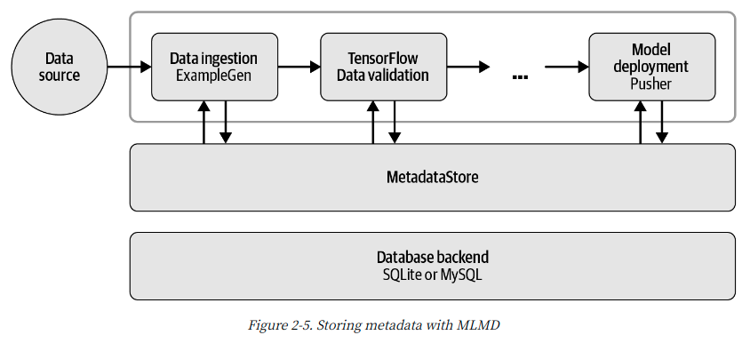
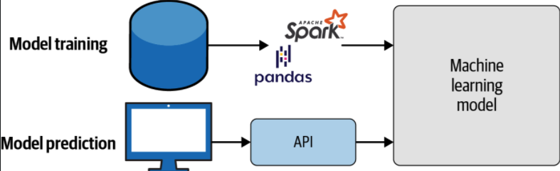

# **발표자**

손주형, 네이버 웹툰 ML 엔지니어 :computer:

**관심사**
ml, tensorflow, onnx, mlops, cloud :thumbsup:

https://github.com/jusonn

---
# mlops로 ml 자동화하기

1. mlops
    - mlops란
    - 사용 예시
2. mlops 컴포넌트
    - 데이터
        - 주입
        - 검증
        - 전처리
    - 모델
        - 학습
        - 검증
    - 서빙
3. 코드로 보기
___

# mlops로 ml 자동화하기

1. mlops
    - mlops란
    - 사용 예시
2. mlops 컴포넌트
    - 데이터
        - 주입
        - 검증
        - 전처리
    - 모델
        - 학습
        - 검증
    - 서빙
3. 코드로 보기

---
# mlops란
> MLOps is a practice for collaboration and communication between data scientists and operations professionals to help **manage production ML lifecycle.**

___

# mlops란
> MLOps is a practice for collaboration and communication between data scientists and operations professionals to help **manage production ML lifecycle.**

**ml + ops**
- mlops, ml 파이프라인으로 불리는 중
- 다양한 오픈소스 개발중 (tfx, kubeflow...)
- 연구, 비즈니스 검증 위주 ➡️ 서비스 적용, 고도화

---
# mlops란
- 연구, 비즈니스 검증 위주 ➡️ 서비스 적용, 고도화

---
# mlops란
- 연구, 비즈니스 검증 위주 ➡️ 서비스 적용, 고도화

[Hidden Technical Debt in Machine Learning Systems, 2015 NIPS](https://papers.nips.cc/paper/5656-hidden-technical-debt-in-machine-learning-systems.pdf)
--- 
# 컴포넌트들

- 데이터
    - 주입
    - 검증
    - 전처리
- 모델
    - 학습
    - 검증
- 서빙

---
# 컴포넌트들

필요한 컴포넌트만 사용

---
# 자동채색 예시

---

# TFX

- 텐서플로우 생태계 구성 중 하나
- ML 파이프라인을 구성하는 컴포넌트 제공
- DB(MetadataStroe) 제공
- jupyter notebook 으로 interactive 파이프라인 기능 제공
- 정식 릴리즈 0.24

---
# TFX
- ML 파이프라인을 구성하는 컴포넌트를 제공

---
# TFX
- 컴포넌트는 MetadataStore를 통해 통신
- MetadataStore를 이용해 모델 혹은 컴포넌트 성능 비교

---
# TFX
**비슷한 파이프라인 오픈소스**

[AeroSolve](https://github.com/airbnb/aerosolve) (airbnb)
[Railyard](https://stripe.com/blog/railyard-training-models) (Stripe)
[Luigi](https://github.com/spotify/luigi) (spotify)
[Michelangelo](https://eng.uber.com/michelangelo-machine-learning-platform/) (Uber)
[Metaflow](https://metaflow.org/) Netflix

---

# 데이터 주입 컴포넌트
> 파이프라인에 데이터 주입
- ml 프로젝트를 시작하는 첫 단계
- 외부의 데이터를 파이프라인에 넣는 컴포넌트
- csv, parquet, avro, tfrecords 등 지원하나 **tfrecords 권장**
- gcp storage bigquery, aws s3 지원

---
# 데이터 주입 컴포넌트

- 데이터 주입
- 데이터 분리 (학습, 검증 데이터)

**인풋**
csv, parquet, avro, tfrecords, ...

**아웃풋**
ExampleGen
    - 데이터셋 수집, 분할하는 파이프라인 초기 입력 컴포넌트
    
--- 
# 데이터 검증 컴포넌트
> 파이프라인에 데이터 주입
- not ML 시스템
    - 데이터 포맷이 올바른지에 관심
--- 
# 데이터 검증 컴포넌트
> 데이터가 현재 모델에 적합한 데이터인지 검증
- ML 시스템
    - 데이터 포맷이 올바른지 + alpha

**garbage in, garbage out**

---
# 데이터 검증 컴포넌트

> 데이터가 현재 모델에 적합한 데이터인지 검증

**TFDV**
-> 정형 데이터에 특화

- missing, empty, anomaly 데이터 탐지
- 학습, 검증 데이터 비교
- 과거, 현재 데이터 비교
- 효과적인, 불필요한 피쳐 찾기

텍스트?
이미지?

---
# 데이터 전처리 컴포넌트
> 검증된 데이터를 모델이 사용할 수 있는 형태로 처리

---
# 데이터 전처리 컴포넌트
> 검증된 데이터를 모델이 사용할 수 있는 형태로 처리

**Training-Serving Skew**
- 학습할 떄와 서빙할 때 데이터를 전처리하는 방법이 다름.
---
# 데이터 전처리 컴포넌트
> 검증된 데이터를 모델이 사용할 수 있는 형태로 처리

**Training-Serving Skew**
- 학습할 떄와 서빙할 때 데이터를 전처리하는 방법이 다름.
- 전처리 서버 구현
    - 서빙서버(trt, tf serving)의 성능을 내줘야함 :angry::angry:
    - 모델마다 다른 전치리 방법
    - 운영 비용 증가
---
# 데이터 전처리 컴포넌트
> 검증된 데이터를 모델이 사용할 수 있는 형태로 처리

**Training-Serving Skew**
- 학습용 전처리 코드, 서빙용 전처리 코드 분리
    - 같은 전처리 코드를 딥러닝 프레임워크 함수로 구현
    - 결국 딥러닝 프레임워크 함수로 구현해야함.
    - 관리 비용 증가 :cry:
---
# 데이터 전처리 컴포넌트
> 검증된 데이터를 모델이 사용할 수 있는 형태로 처리

**TFT**
- 동일한 코드로 학습, 서빙에 사용

**but**
- tf 함수를 이용해 전처리 코드 짜야함.
---

# 학습 컴포넌트
> 학습 코드를 받아 학습, 학습 결과물을 저장

- 기존 모델의 학습 루프를 그대로 사용.
---
# 모델 검증, 분석 컴포넌트
> 학습된 모델을 분석하고 배포중인 모델의 성능을 비교 후 대체

- Metric을 이용해 모델 분석

**loss vs metric**

- loss: 학습시 모델이 보는 성능 지표
- metric: 사람이 보는 성능 지표
    - 해석이 쉽고 좀 더 설명이 쉬움

---
# 모델 검증, 분석 컴포넌트
> 학습된 모델을 분석하고 배포중인 모델의 성능을 비교 후 대체

- Metric을 이용해 모델 분석

#### Classification
- accuracy, precision, recall ...

#### Regression
- MAE, MSE ...

#### GAN
- :eye::eye:

---
# 모델 검증, 분석 컴포넌트
> 학습된 모델을 분석하고 배포중인 모델의 성능을 비교 후 대체

**XAI**
- TFMA
- WhatIfTool

--- 
# 서빙 컴포넌트
> 클라이언트에게 모델 아웃풋을 제공

**딥러닝 모델 서빙**
- 연산량 많음
- GPU 사용(성능, 메모리..)
- 배치 단위 인퍼런스

--- 
# 서빙 컴포넌트
> 클라이언트에게 모델 아웃풋을 제공

**파이썬 웹 서버(flask, fastAPI, django)**

- 가벼운 것에 쉽게 적용 가능, 개발 쉬움.
- 성능 많이 떨어짐
- 구현해야할 기능이 너무 많음
    - gpu 스케쥴링
    - 배치 인퍼런스
    - 모델 버전 관리
    - etc

--- 
# 서빙 컴포넌트
> 클라이언트에게 모델 아웃풋을 제공

- [TF Serving](https://www.tensorflow.org/tfx/guide/serving)
- [Triton Serving Server](https://github.com/triton-inference-server/server)
- [onnx runtime](https://microsoft.github.io/onnxruntime/)
- [tvm](https://tvm.apache.org/)

--- 
# 서빙 컴포넌트
> 클라이언트에게 모델 아웃풋을 제공

**서빙 서버를 쓰는 이유**
- 다양한 프레임워크 지원
- 동시 서빙
- 배치 단위의 서빙
- 모델 관리
- 멀티 gpu
- http/grpc 프로토콜 제공
- metric 수집
- etc

--- 
# 서빙 컴포넌트
> 클라이언트에게 모델 아웃풋을 제공

서빙 구조

---
# 서빙 컴포넌트
> 클라이언트에게 모델 아웃풋을 제공

tf serving 설명

---
# 서빙 컴포넌트
> 클라이언트에게 모델 아웃풋을 제공

최적화

---
# 파이프라인
> kubeflow