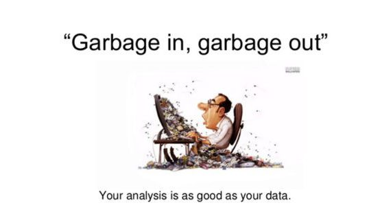

# **발표자**

손주형, 네이버 웹툰 ML 엔지니어 :computer:

**관심사**
ml, tensorflow, onnx, mlops, cloud :thumbsup:

https://github.com/jusonn

---
# mlops로 ml 자동화하기

1. mlops
    - mlops란
    - 사용 예시
2. mlops 컴포넌트
    - 데이터
        - 주입
        - 검증
        - 전처리
    - 모델
        - 학습
        - 검증
    - 서빙
3. 코드로 보기
___

# mlops로 ml 자동화하기

1. mlops
    - mlops란
    - 사용 예시
2. mlops 컴포넌트
    - 데이터
        - 주입
        - 검증
        - 전처리
    - 모델
        - 학습
        - 검증
    - 서빙
3. 코드로 보기

---
# mlops란
> MLOps is a practice for collaboration and communication between data scientists and operations professionals to help **manage production ML lifecycle.**


___

# mlops란
> MLOps is a practice for collaboration and communication between data scientists and operations professionals to help **manage production ML lifecycle.**

**ml + ops**
- mlops, ml 파이프라인으로 불리는 중
- 다양한 오픈소스 개발중 (tfx, kubeflow...)
- 연구, 비즈니스 검증 위주 ➡️ 서비스 적용, 고도화

---
# mlops란
- 연구, 비즈니스 검증 위주 ➡️ 서비스 적용, 고도화


---
# mlops란
- 연구, 비즈니스 검증 위주 ➡️ 서비스 적용, 고도화

[Hidden Technical Debt in Machine Learning Systems, 2015 NIPS](https://papers.nips.cc/paper/5656-hidden-technical-debt-in-machine-learning-systems.pdf)
--- 
# 컴포넌트들


- 데이터
    - 주입
    - 검증
    - 전처리
- 모델
    - 학습
    - 검증
- 서빙

---
# 컴포넌트들


프로젝트에 따라 필요한 컴포넌트만 사용

---
# 사내 프로젝트 예시


---

# TFX

- 텐서플로우 생태계 구성 중 하나
- ML 파이프라인을 구성하는 컴포넌트 제공, 파이프라인 X
- DB(MetadataStroe) 제공
- tfdv, tft 등 tf 라이브러리 포함
- jupyter notebook 으로 interactive 파이프라인 기능 제공
- 정식 릴리즈 0.24

---
# TFX
- ML 파이프라인을 구성하는 컴포넌트를 제공


---
# TFX
- 컴포넌트는 DB(MetadataStore)를 통해 통신
- MetadataStore를 이용해 모델 혹은 컴포넌트 성능 비교 가능

---
# TFX
**비슷한 mlops 오픈소스**

[AeroSolve](https://github.com/airbnb/aerosolve) (airbnb)
[Railyard](https://stripe.com/blog/railyard-training-models) (Stripe)
[Luigi](https://github.com/spotify/luigi) (spotify)
[Michelangelo](https://eng.uber.com/michelangelo-machine-learning-platform/) (Uber)
[Metaflow](https://metaflow.org/) Netflix

---
# 파이프라인

ml 컴포넌트를 실행, 모니터링
- [airflow](https://airflow.apache.org/)
- [apach beam](https://beam.apache.org/)
- [kubeflow](https://www.kubeflow.org/)
- [mlflow](https://mlflow.org/)

---

# 데이터 주입 컴포넌트
> 데이터 준비하고 파이프라인에 주입
- ml 프로젝트를 시작하는 첫 단계
- 외부의 데이터를 파이프라인에 넣는 컴포넌트
    - csv, parquet, avro, tfrecords 등 지원하나 **tfrecords 권장**
    - gcp storage bigquery, aws s3 지원

---
# 데이터 주입 컴포넌트
> 데이터 준비하고 파이프라인에 주입

- 데이터 준비
    - 데이터 읽기
    - 분리 (학습, 검증)
    - tfrecords로 저장
- 데이터 주입

---
# 데이터 주입 컴포넌트
> 데이터 준비하고 파이프라인에 주입

**인풋**
csv, parquet, avro, tfrecords, ...

**아웃풋**
ExampleGen
    - 데이터셋 수집, 분할하는 파이프라인 초기 입력 컴포넌트
    
--- 
# 데이터 검증 컴포넌트
> 데이터가 현재 모델에 적합한 데이터인지 검증
- not ML 시스템
    - 데이터 포맷, 타입이 올바른지에 관심
    
--- 
# 데이터 검증 컴포넌트
> 데이터가 현재 모델에 적합한 데이터인지 검증
- ML 시스템
    - 데이터 포맷, 타입이 올바른지 + alpha


--- 
# 데이터 검증 컴포넌트
> 데이터가 현재 모델에 적합한 데이터인지 검증
- ML 시스템
    - 데이터 포맷, 타입이 올바른지 + alpha
- 새로 들어온 데이터가 모델의 성능을 향상 시킬 수 있는 데이터인지 확인
    - 데이터 분포
**garbage in, garbage out**


---
# 데이터 검증 컴포넌트
> 데이터가 현재 모델에 적합한 데이터인지 검증

**TFDV**
-> 정형 데이터에 특화된 데이터 검증 라이브러리

- missing, empty, anomaly 데이터 탐지
- 학습, 검증 데이터 비교
- 과거, 현재 데이터 비교
- 효과적인, 불필요한 피쳐 찾기

텍스트, 이미지 데이터의 경우엔??
>> 아직 빈약

---
# 데이터 전처리 컴포넌트
> 검증된 데이터를 모델이 사용할 수 있는 형태로 처리

**Training-Serving Skew**

---
# 데이터 전처리 컴포넌트
> 검증된 데이터를 모델이 사용할 수 있는 형태로 처리


**Training-Serving Skew**
- 학습할 떄와 서빙할 때 데이터를 전처리하는 방법이 다름.
    - 코드 관리가 어려워짐
    - 전처리 api 필요함
    
---
# 데이터 전처리 컴포넌트
> 검증된 데이터를 모델이 사용할 수 있는 형태로 처리

**Training-Serving Skew**
- 학습할 떄와 서빙할 때 데이터를 전처리하는 방법이 다름.

**해결 방법**
- 전처리 서버 구현
    - 서빙서버(trt, tf serving)의 성능을 내줘야함 :angry::angry:
        - 파이썬으로 하던 전처리..
        - C++로 수년간 개발되어 온 서빙서버들..
    - 비용 증가
        - 모델마다 다른 전치리 방법 
    - 운영 비용 증가

---
# 데이터 전처리 컴포넌트
> 검증된 데이터를 모델이 사용할 수 있는 형태로 처리

**Training-Serving Skew**
- 학습할 떄와 서빙할 때 데이터를 전처리하는 방법이 다름.

**해결 방법**
- 백엔드 서버에다 구현
    - 백엔드 서버에서 전처리 진행 후 서빙 요청
        - 쉽다.
    - 비용 증가
        - 백엔드 서버 성능에 영향을 끼침.
---
# 데이터 전처리 컴포넌트
> 검증된 데이터를 모델이 사용할 수 있는 형태로 처리

**Training-Serving Skew**
- 학습할 떄와 서빙할 때 데이터를 전처리하는 방법이 다름.

**해결 방법**
- 전처리를 프레임워크 함수로 구현
    - 전처리 함수를 딥러닝 프레임워크 함수로 구현
        - 모델 저장시 전처리 그래프도 함께 저장 가능
    - 관리 비용 감소
        - 서빙서버만 사용
        - 전처리 함수 통합
    - 구현 난이도 증가
    - torch의 경우 전처리를 위한 함수가 많지 않음.
 
---
# 데이터 전처리 컴포넌트
> 검증된 데이터를 모델이 사용할 수 있는 형태로 처리


**[TFT](https://www.tensorflow.org/tfx/transform/get_started)**
- 동일한 코드로 학습, 서빙에 사용
- tf.image, tf.text, tf.audio, tfa 등등 사용가능

**but**
- tf 함수를 이용해 전처리 코드 짜야함.

---
# 학습 컴포넌트
> 학습 코드를 받아 학습 후 결과물을 저장

- 특별한 변경은 없음
- TFX의 Trainer 컴포넌트 사용
    - run_fn() 함수를 구현 해놓으면 컴포넌트가 가져다 사용
    - run_fn()은 기존 학습하던 방식대로
        - 데이터를 읽고
        - 학습을 하고
        - 결과를 저장하면 됨

---
# 모델 검증, 분석 컴포넌트
> 학습된 모델을 분석하고 배포중인 모델의 성능을 비교 후 대체

- Metric을 이용해 모델 분석

**loss vs metric**

- loss: 학습시 모델이 보는 성능 지표
---
# 모델 검증, 분석 컴포넌트
> 학습된 모델을 분석하고 배포중인 모델의 성능을 비교 후 대체

- Metric을 이용해 모델 분석

**loss vs metric**

- loss: 학습시 모델이 보는 성능 지표

---
# 모델 검증, 분석 컴포넌트
> 학습된 모델을 분석하고 배포중인 모델의 성능을 비교 후 대체

- Metric을 이용해 모델 분석

**loss vs metric**

- loss: 학습시 모델이 보는 성능 지표
- metric: 사람이 보는 성능 지표
    - 해석이 쉽고 좀 더 설명이 쉬움
---
# 모델 검증, 분석 컴포넌트
> 학습된 모델을 분석하고 배포중인 모델의 성능을 비교 후 대체

- Metric을 이용해 모델 분석

**loss vs metric**

- loss: 학습시 모델이 보는 성능 지표
- metric: 사람이 보는 성능 지표
    - 해석이 쉽고 좀 더 설명이 쉬움
---
# 모델 검증, 분석 컴포넌트
> 학습된 모델을 분석하고 배포중인 모델의 성능을 비교 후 대체

- Metric을 이용해 모델 분석

#### Classification
- accuracy, precision, recall ...

#### Regression
- MAE, MSE ...

#### GAN
- :eye::eye:

---
# 모델 검증, 분석 컴포넌트
> 학습된 모델을 분석하고 배포중인 모델의 성능을 비교 후 대체

**XAI**
- TFMA
- WhatIfTool

--- 
# 서빙 컴포넌트
> 클라이언트에게 모델 아웃풋을 제공

**딥러닝 모델 서빙**
- 연산량 많음
- GPU 사용(성능, 메모리..)
- 배치 단위 인퍼런스

--- 
# 서빙 컴포넌트
> 클라이언트에게 모델 아웃풋을 제공

**파이썬 웹 서버(flask, fastAPI, django)**

- 가벼운 것에 쉽게 적용 가능, 개발 쉬움.
- 성능 많이 떨어짐
- 구현해야할 기능이 너무 많음
    - gpu 스케쥴링
    - 배치 인퍼런스
    - 모델 버전 관리
    - etc

--- 
# 서빙 컴포넌트
> 클라이언트에게 모델 아웃풋을 제공

- [TF Serving](https://www.tensorflow.org/tfx/guide/serving)
- [Triton Serving Server](https://github.com/triton-inference-server/server)
- [onnx runtime](https://microsoft.github.io/onnxruntime/)
- [tvm](https://tvm.apache.org/)

--- 
# 서빙 컴포넌트
> 클라이언트에게 모델 아웃풋을 제공

**서빙 서버를 쓰는 이유**
- 다양한 프레임워크 지원
- 동시 서빙
- 배치 단위의 서빙
- 모델 관리
- 멀티 gpu
- http/grpc 프로토콜 제공
- metric 수집
- etc

--- 
# 서빙 컴포넌트
> 클라이언트에게 모델 아웃풋을 제공
**[TF Serving](https://github.com/tensorflow/serving)**

**Saved Model**
```python
saved_model_path = model.save(path, save_format='tf')
```

- saved_model.pb: 모델 그래프 구조가 저장된 binary pb 파일
- variables: 모델 그래프의 변수들이 저장된 폴더
- assets: 모델에 필요한 추가적인 파일들 ex) vocab

```bash
$ tree saved_models/
saved_models/
└── 1555875926
    ├── assets
    │   └── saved_model.json
    ├── saved_model.pb
    └── variables
        ├── checkpoint
        ├── variables.data-00000-of-00001
        └── variables.index

3 directories, 5 files
```

--- 
# 서빙 컴포넌트
> 클라이언트에게 모델 아웃풋을 제공

**Model Signatures**

- 모델 그래프의 인풋, 아웃풋, 서빙 방법을 확인
- model signature를 바꾸는 것만으로 필요한 결과물을 변경 가능
- `predict`, `classify`, `regress` 방법을 제공
    - 모델이 어떤 문제냐에 따라 방법을 다르게 사용.
    - 잘 모르겠다면 predict만 사용하면 됨

--- 
# 서빙 컴포넌트
> 클라이언트에게 모델 아웃풋을 제공

**Model Signatures**

- predict
    - savedModel의 디폴트 설정, 가장 유연한 방법
    - 아웃풋을 추가하는 것이 가능 (ex. attention 레이어 아웃풋 추가)
    - 
```json
signature_def: {
  key  : "prediction_signature"
  value: {
    inputs: {
      key  : "inputs"
      value: {
        name: "sentence:0"
        dtype: DT_STRING
        tensor_shape: ...
      },
      ...
    }
    outputs: {
      key  : "scores"
      value: {
        name: "y:0"
        dtype: ...
        tensor_shape: ...
      }
    }
    method_name: "tensorflow/serving/predict"
  }
}
```

- classify
    - 하나의 인풋과 2개의 아웃풋(클래스, 스코어)을 제공하는 방법
```json
signature_def: {
  key  : "classification_signature"
  value: {
    inputs: {
      key  : "inputs"
      value: {
        name: "sentence:0"
        dtype: DT_STRING
        tensor_shape: ...
      }
    }
    outputs: {
      key  : "classes"
      value: {
        name: "y_classes:0"
        dtype: DT_UINT16
        tensor_shape: ...
      }
    }
    outputs: {
      key  : "scores"
      value: {
        name: "y:0"
        dtype: DT_FLOAT
        tensor_shape: ...
      }
    }
    method_name: "tensorflow/serving/classify"
  }
}
```

- regress
    - 하나의 인풋과 하나의 아웃풋을 제공하는 방법
```json
signature_def: {
  key  : "regression_signature"
  value: {
    inputs: {
      key  : "inputs"
      value: {
        name: "input_tensor_0"
        dtype: ...
        tensor_shape: ...
      }
    }
    outputs: {
      key  : "outputs"
      value: {
        name: "y_outputs_0"
        dtype: DT_FLOAT
        tensor_shape: ...
      }
    }
    method_name: "tensorflow/serving/regress"
  }
}
```

--- 
# 서빙 컴포넌트
> 클라이언트에게 모델 아웃풋을 제공

**cli 로 model inspect**
`$ pip install tensorflow-serving-api`

```bash
$ saved_model_cli show --dir saved_models/
The given SavedModel contains the following tag-sets:
serve
```

```bash
$ saved_model_cli show --dir saved_models/ --tag_set serve
The given SavedModel 'MetaGraphDef' contains 'SignatureDefs' with the
following keys:
SignatureDef key: "serving_default"
```

```bash
$ saved_model_cli show --dir saved_models/ \
        --tag_set serve --signature_def serving_default
The given SavedModel SignatureDef contains the following input(s):
  inputs['examples'] tensor_info:
      dtype: DT_STRING
      shape: (-1)
      name: serving_default_examples:0
The given SavedModel SignatureDef contains the following output(s):
  outputs['outputs'] tensor_info:
      dtype: DT_FLOAT
      shape: (-1, 1)
      name: StatefulPartitionedCall_1:0
Method name is: tensorflow/serving/predict
```

```python
signatures = {
    'serving_default':
        _get_serve_tf_examples_fn(
            model,
            tf_transform_output).get_concrete_function(
                tf.TensorSpec(
                    shape=[None],
                    dtype=tf.string,
                    name='examples')
            )
}
model.save(fn_args.serving_model_dir,
            save_format='tf', signatures=signatures)
```

--- 
# 서빙 컴포넌트
> 클라이언트에게 모델 아웃풋을 제공

`$ pip install tensorflow-serving-api`
:bad:

`$ docker pull tensorflow/serving:latest-gpu`


--- 
# 서빙 컴포넌트
> 클라이언트에게 모델 아웃풋을 제공

```bash
$ docker run -p 8500:8500 \ 
             -p 8501:8501 \
             --mount type=bind,source=/tmp/models,target=/models/my_model \ 
             -e MODEL_NAME=my_model \ 
             -e MODEL_BASE_PATH=/models/my_model \
             -t tensorflow/serving
```

---
# 서빙 컴포넌트
> 클라이언트에게 모델 아웃풋을 제공

tf serving 설명

---
# 서빙 컴포넌트
> 클라이언트에게 모델 아웃풋을 제공

최적화

---
# 파이프라인
> kubeflow