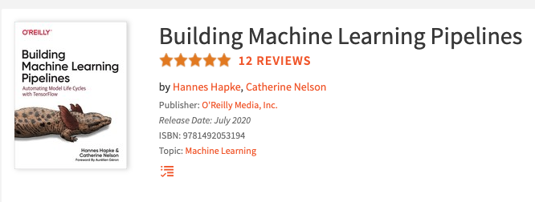
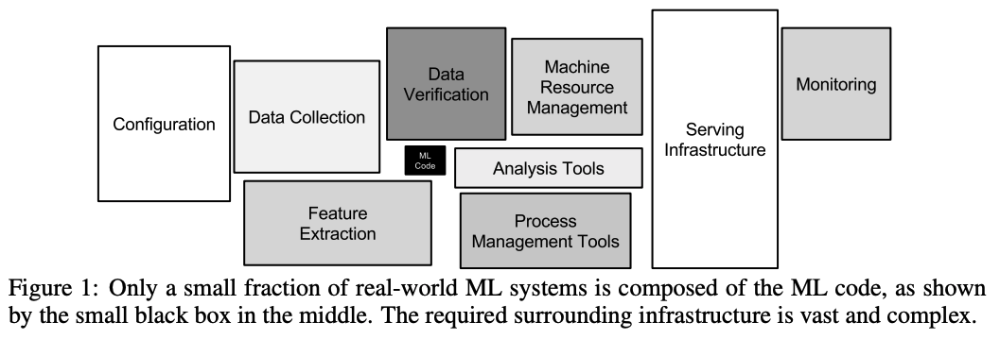
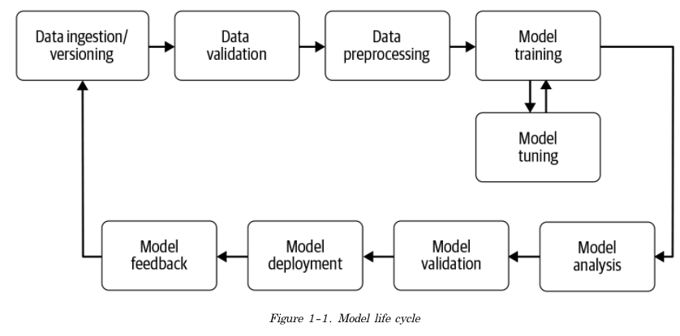
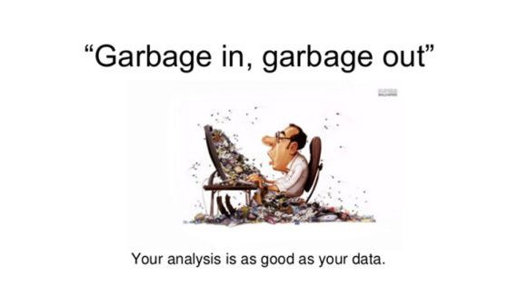

# **발표자**

손주형, 네이버 웹툰 ML 엔지니어 :computer:

tensorflow, onnx, mlops, cloud :thumbsup:

https://github.com/jusonn

---
# mlops로 ml 자동화하기

1. mlops
    - 왜?
    - 사용 예시
2. 컴포넌트들
    - 데이터
        - 주입
        - 검증
        - 전처리
    - 모델
        - 학습
        - 검증
    - 서빙
___

# mlops로 ml 자동화하기

1. mlops
    - mlops란
    - 사용 예시
2. 컴포넌트들
    - 데이터
        - 주입
        - 검증
        - 전처리
    - 모델
        - 학습
        - 검증
    - 서빙
___

# mlops란

> MLOps is a practice for collaboration and communication between data scientists and operations professionals to help **manage production ML lifecycle.**

ml + ops
- mlops, ml 파이프라인 ...
- 최근 들어 자주 보임
- 연구, 검증 위주 ➡️ 서비스 적용, 고도화
---
# mlops란
- 연구, 비즈니스 검증 위주 ➡️ 서비스 적용, 고도화

[Hidden Technical Debt in Machine Learning Systems, 2015 NIPS](https://papers.nips.cc/paper/5656-hidden-technical-debt-in-machine-learning-systems.pdf)
--- 
# 컴포넌트들

### 컴포넌트들
- 데이터
    - 주입
    - 검증
    - 전처리
- 모델
    - 학습
    - 검증
- 서빙

---

# 데이터 주입 컴포넌트
> 파이프라인에 데이터 주입
- ml 프로젝트를 시작하는 첫 단계
- 외부의 데이터를 파이프라인에 넣는 컴포넌트
- csv, parquet, avro, tfrecords 등 지원하나 **tfrecords 권장**
- gcp storage bigquery, aws s3 지원

**주요 기능**
- 데이터 분리
- 데이터 spanning

---

# 데이터 주입 컴포넌트
> 파이프라인에 데이터 주입
### 텍스트 데이터

---
# 데이터 주입 컴포넌트
> 파이프라인에 데이터 주입
### 이미지 데이터

--- 
# 데이터 검증 컴포넌트
> 파이프라인에 데이터 주입
- not ML 시스템
    - 데이터 포맷이 올바른지에 관심
--- 
# 데이터 검증 컴포넌트
> 데이터가 현재 모델에 적합한 데이터인지 검증
- ML 시스템
    - 데이터 포맷이 올바른지 + alpha

**garbage in, garbage out**

---
# 데이터 검증 컴포넌트

> 데이터가 현재 모델에 적합한 데이터인지 검증

**TFDV**
-> 정형 데이터에 특화

- missing, empty, anomaly 데이터 탐지
- 효과적인, 불필요한 피쳐 찾기

텍스트?
이미지?

---
# 데이터 전처리 컴포넌트
> 검증된 데이터를 모델이 사용할 수 있는 형태로 처리

**Training-Serving Skew**

- 학습할 떄와 서빙할 때 데이터를 전처리하는 방법이 다름.
- 학습용 전처리 코드, 서빙용 전처리 코드
    - 관리 비용 증가 :cry:
    - 전처리용 서버 구현 :angry::angry:

**TFT**

- training-serving skew 문제를 해결
---
# 학습 컴포넌트
> 학습 코드를 받아 학습, 학습 결과물을 저장